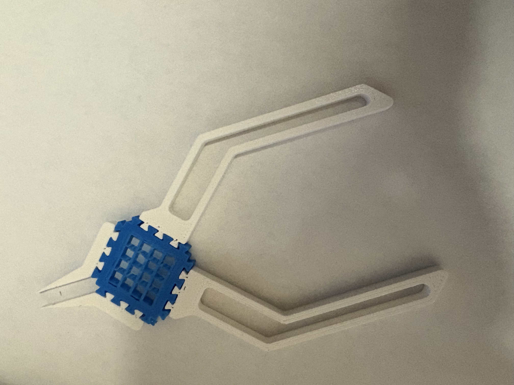
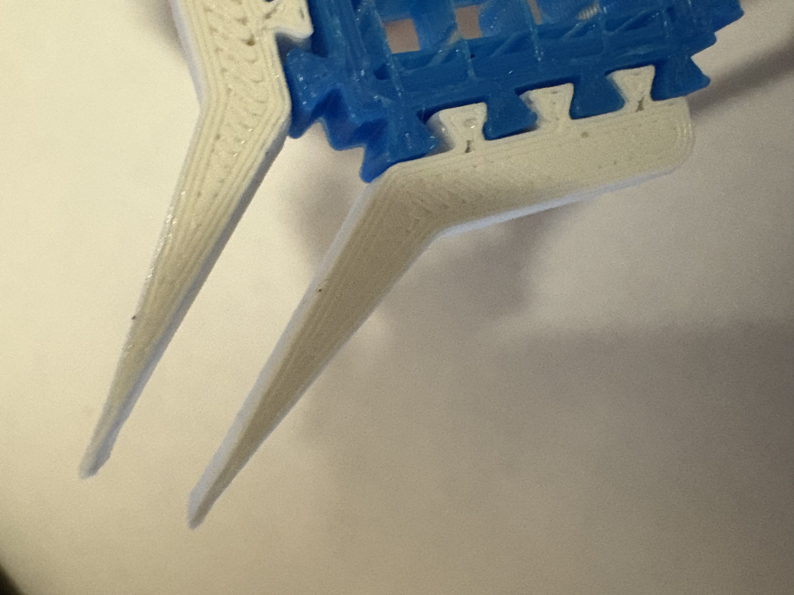

# Print in Place Pliers!!!

## Understanding Print-in-Place 3D Printing
Print-in-place refers to a 3D printing method where interlocking or movable components are fabricated simultaneously as a single, unified structure. This approach leverages precise design and printing tolerances to ensure that parts remain distinct yet functional upon completion. The key advantage is the elimination of manual assembly and post-processing, streamlining the production process and reducing the potential for assembly errors.

## Exploring Applications of Print-in-Place Designs
The versatility of print-in-place techniques has been demonstrated across various innovative projects, including:
* [Spring-Loaded Boxes:](https://www.instructables.com/Print-in-Place-Spring-Loaded-Box/) 
Designed to print as a single piece, these boxes incorporate built-in hinges and latches, functioning immediately after printing without additional assembly.
* [Collapsible Katanas:](https://www.printables.com/model/543260-collapsing-katana-v2-print-in-place)
  These intricate models feature telescoping blades that extend and retract, all printed as a cohesive unit, showcasing the potential for complex, movable designs.
* [Gear Bearings:](https://www.thingiverse.com/thing:53451) 
Functional bearings printed in one piece, demonstrating the ability to create moving mechanical parts without separate components.

## Selecting Suitable Materials for Print-in-Place Projects
Choosing the appropriate material is crucial for the success of print-in-place designs. Materials must balance strength, flexibility, and ease of printing to ensure functional movement and durability. Commonly used materials include:
* Polylactic Acid (PLA): Known for its ease of printing and biodegradability, PLA is a popular choice for print-in-place designs. However, its brittleness may limit the durability of moving parts.
* Acrylonitrile Butadiene Styrene (ABS): Offers greater strength and flexibility compared to PLA, making it suitable for functional parts requiring durability. ABS's higher melting temperature necessitates a heated print bed and controlled printing environment.
* Thermoplastic Polyurethane (TPU): A flexible, rubber-like material ideal for designs requiring elasticity. TPU's flexibility allows for the creation of complex, movable parts that can withstand repeated use.

## Inside the Design: Iteration, Materials & Functionality

### Modular by Nature: A Five-Part Assembly
While traditional print-in-place models are typically printed as one single assembly, I took a modular approach to refine both function and fit. The pliers are composed of five interlocking parts:
* 2 Jaw components (PLA)
* 2 Handle components (PLA)
* 1 Central spring piece (TPU)

Using PLA for the rigid sections and TPU for the flexible spring made it possible to balance strength and elasticity. If you have a multi-material 3D printer, these could potentially be printed as one cohesive unit. But even printed separately, the components snap together with a puzzle-like interlock that keeps them secure during use, while still allowing disassembly.

### Iteration for Optimization
In order to account for clearance and the expansion of the filament and accuracy of the printed I printed the jaws and handle once but printed several different versions of the center piece and used the one that fit the best. The goal was to achieve a snug, reliable fit that wouldn’t fall apart under pressure, but also wouldn’t jam during assembly.

The spring mechanism itself is deceptively simple: it’s just the center TPU piece. But by removing the top and bottom layers in the slicer and relying solely on infill (set to monotonic at 13%), the piece behaves like a spring when compressed. To optimize this, I rotated the part 45 degrees during printing to align the infill parallel to the wall, this maximized flexibility in the direction of force when squeezing the pliers. I also increased perimeter walls to 4 for durability and ended up using the center piece which scaled the X and Y dimensions to about 105%.

#### Specifications:
* Jaw length: ~25mm

* Handle length: ~70mm

* Material usage: ~12g total filament

* Print time: <1 hour

* Assembly: Snap-fit, no tools or adhesives

These specs make the pliers not only compact and comfortable to hold but also highly efficient to print—ideal for quick prototypes, educational kits, or functional models.

#### Print Settings:
* Printer: Voron (FDM)
* Nozzle size: 0.4mm (PLA), 0.6mm (TPU)
* Material: PLA for jaws and handles, TPU for the central spring
* PLA parts:
  * printed with default slicer settings
* TPU spring:
  * No top/bottom layers
  * 13% monotonic infill
  * 4 perimeter walls
  * Rotated 45 degrees for optimal infill direction
  * Scaled to 105% in X/Y for final fit

## Gallery

<iframe src="https://giphy.com/embed/YAhs3rJPzi5hJgROhP" width="270" height="480" style="" frameBorder="0" class="giphy-embed" allowFullScreen></iframe>
<a href="https://giphy.com/gifs/YAhs3rJPzi5hJgROhP">via GIPHY</a>

<iframe src="https://giphy.com/embed/gA7QCfl7E8DRRx9t9y" width="270" height="480" style="" frameBorder="0" class="giphy-embed" allowFullScreen></iframe>
<a href="https://giphy.com/gifs/gA7QCfl7E8DRRx9t9y">via GIPHY</a>

<iframe src="https://giphy.com/embed/s9vERsKYhdbtLBrSJH" width="270" height="480" style="" frameBorder="0" class="giphy-embed" allowFullScreen></iframe>
<a href="https://giphy.com/gifs/s9vERsKYhdbtLBrSJH">via GIPHY</a>

<iframe src="https://giphy.com/embed/FHk67ShcxPJfALXXQQ" width="270" height="480" style="" frameBorder="0" class="giphy-embed" allowFullScreen></iframe>
<a href="https://giphy.com/gifs/FHk67ShcxPJfALXXQQ">via GIPHY</a>

### CAD Model:
<iframe src="https://vanderbilt643.autodesk360.com/g/shares/SH286ddQT78850c0d8a4b3b90ac2a874adfa?mode=embed" width="640" height="480" allowfullscreen="true" webkitallowfullscreen="true" mozallowfullscreen="true"  frameborder="0"></iframe>