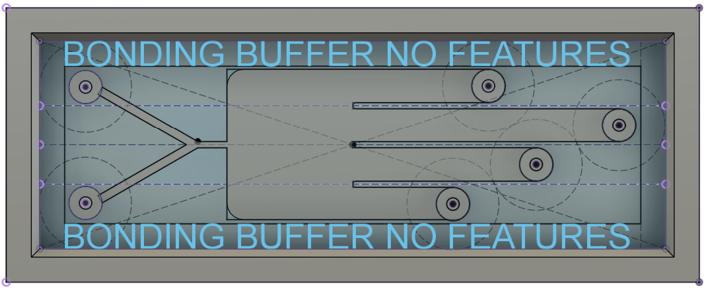
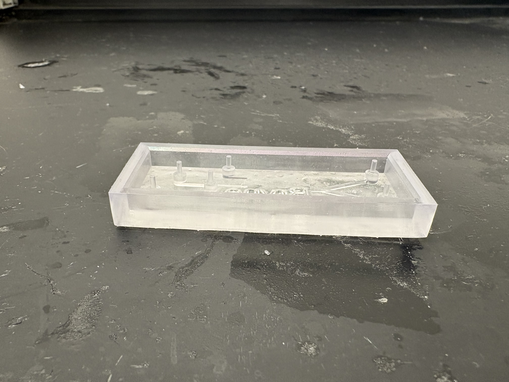
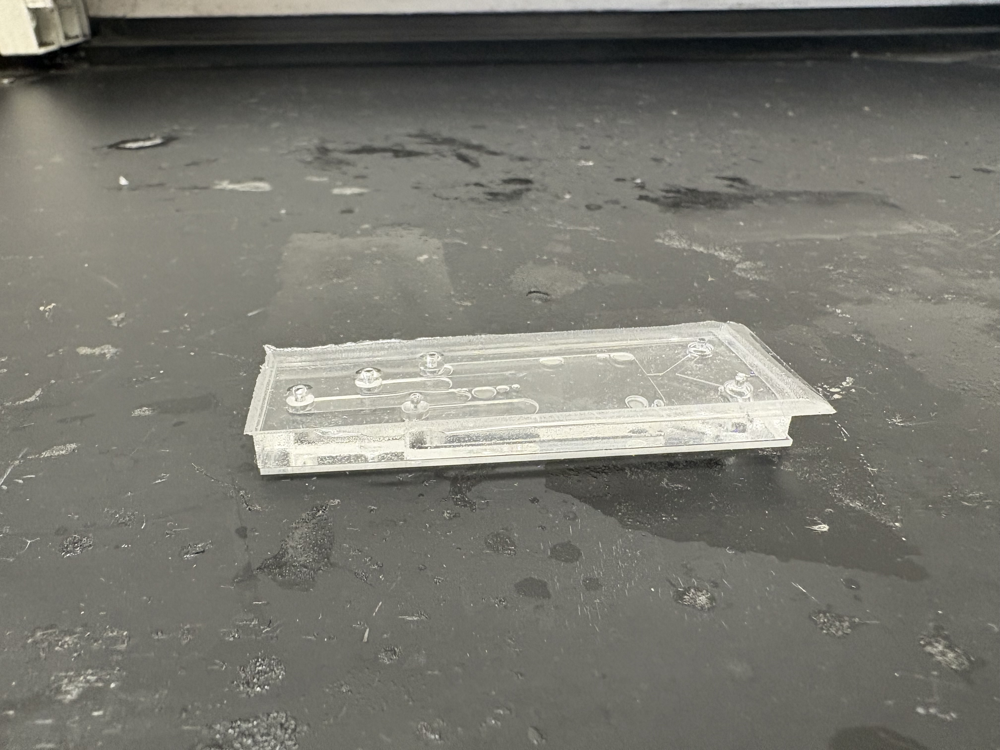
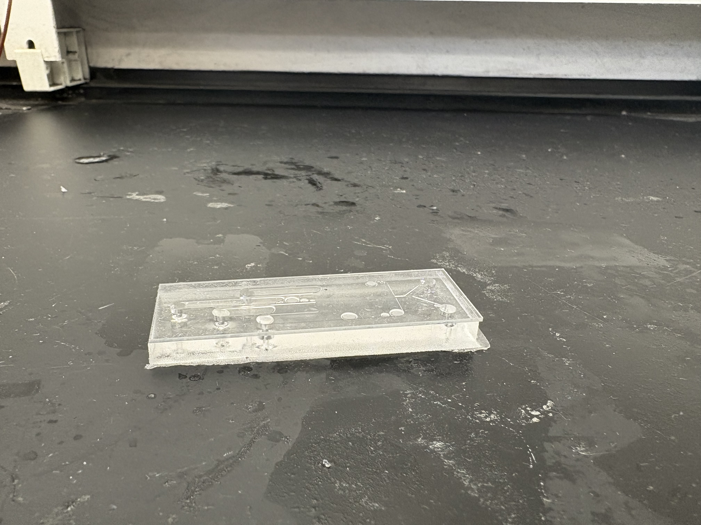

# MicroFluidic Pinch Flow Fractionation

## Introduction:
### Generally describe ufluidic devices
Microfluidic devices are systems that precisely manipulate small volumes of fluids—typically in the microliter to nanoliter range—through networks of tiny channels. These devices are designed to perform complex tasks such as mixing, sorting, or analyzing fluids and suspended particles, all on a miniaturized "lab-on-a-chip" platform. Their small scale enables rapid, high-throughput analysis with low reagent consumption, making them widely useful in diagnostics, biomedical research, drug development, and environmental testing.

### What is pinch flow fractionation? How does it work?
Pinched Flow Fractionation is a passive microfluidic technique used for the continuous separation of particles by size. It works by introducing two fluid streams—one carrying suspended particles and another as a sheath flow—into a narrow constriction (the "pinched" segment). In this segment, the sheath flow pushes all particles toward one sidewall, aligning them into a single streamline regardless of size.
As the channel broadens downstream, particles begin to drift apart due to their different sizes: larger particles are pushed further away from the sidewall due to their centers being farther from the aligned streamline, while smaller particles remain closer to the wall. The spatial separation becomes significant in the broader section, allowing the particles to be collected through separate outlet channels.
This method is advantageous because it relies solely on laminar flow and channel geometry—no external forces or fields are needed—making it simple, cost-effective, and scalable.

### Provide at least one specific application that requires sorting of small particles. Include at least one citation from primary literature.
One important application of particle sorting is in cell separation for biomedical diagnostics. For instance, isolating circulating tumor cells (CTCs) from blood is a crucial step in early cancer detection and monitoring. Since CTCs are typically larger than most other blood cells, techniques like Pinched Flow Fractionation can be used to separate and enrich CTCs from patient samples without the need for labels or complex instrumentation.

[This foundational study demonstrated high-efficiency separation of particles based on size using a pinched microchannel design, forming the basis for many modern microfluidic sorting systems.](https://pubs.acs.org/doi/10.1021/ac049863r)

Another important real-world application of particle sorting is the separation of microplastic particles from water samples in environmental research. These plastic particles, often ranging from tens to hundreds of microns, must be distinguished from organic matter, sand, or other debris. PFF offers a label-free, continuous method for sorting microplastics by size prior to downstream analysis such as spectroscopy or chemical assays.

[This study demonstrates the use of a parylene-coated 3D-printed mold to fabricate microfluidic devices capable of robust microplastic separation under realistic sample conditions. Their work highlights how modern fabrication techniques can expand the applicability of PFF to real-world challenges.](https://pubs.rsc.org/en/content/articlelanding/2021/lc/d1lc00744k)
## Instructions:
### CAD Model
The microfluidic device is designed to perform Pinched Flow Fractionation (PFF) with two inlets, a pinched segment, a broadening region, and four outlets for effective particle sorting.
Key Design Features:
* Inlet channels:
Two inlets (1 mm wide, 13.2 mm long) leading to the pinched segment.
* Pinched segment:
3.5 mm long, 0.75 mm wide (ensures effective particle alignment).
* Broadening segment:
18.13 mm wide (designed to evenly distribute flow across four outlets).
* Outlet channels:
Four equal 4 mm wide outlets, ensuring balanced flow and space for barb fittings.
* Spacing considerations:
All inlets and outlets are sufficiently spaced apart to accommodate barb fittings.
Bonding buffer zones (3 mm from edges) remain clear of features for proper sealing.

### Print and cure mold
#### A. Printing the Mold
Print the mold using a Formlabs SLA 3D printer with black or high-temperature resin.
Use a 0.025 mm or 0.05 mm layer thickness to maintain high precision.
Orient the mold flat on the build plate to ensure a smooth bottom surface and ignore cupping warning when printing.
Make sure the device prints flat on the build plate and no support is on the inside of the device.

#### B. Post-Processing the Printed Mold
1. IPA Wash:
Rinse in isopropyl alcohol (IPA) for 5 minutes on the print bed.
Transfer to a fresh IPA bath and wash for another 5 minutes.
Do not exceed 15 minutes total IPA exposure (prevents resin softening).

2. Drying:
Air-dry upside down for 30 minutes to allow IPA to evaporate.
Use compressed air to remove liquid trapped inside channels.

3. UV Post-Curing (60 Seconds)
Place the mold in a UV curing station for 1 minute (room temperature, no heat).
Do not over-cure, as excessive UV exposure may warp the mold.

4. Inspect the Mold:
Check for shiny areas (indicates uncured resin) and repeat IPA washing if needed.
Ensure smooth surfaces inside channels to prevent PDMS curing inhibition.

### Parylene device
A parylene coating is applied to prevent PDMS curing issues and improve surface smoothness.

#### Why Parylene Coating?
It prevents PDMS curing inhibition from uncured resin, ensures easy demolding of PDMS without defects and creates hydrophobic surfaces to enhance fluid control.

#### Application Process:
The mold is placed in a parylene deposition chamber.
A thin layer of parylene is vapor-deposited onto the mold’s surface.
Final inspection ensures a uniform, defect-free coating.

### PDMS Casting
#### PDMS Preparation:

1. Mix PDMS (Sylgard 184).
10:1 ratio (base to curing agent).
Stir slowly to minimize air bubble formation.

2. Degassing:
Place the mixture in a vacuum chamber for 30 minutes to remove air bubbles.

#### Pouring and Curing
1. Pour PDMS into Mold:
Slowly pour PDMS into the mold while tilting slightly to prevent air trapping.
Gently tap the mold to release trapped air bubbles.

2. Final Degassing:
Place the mold with PDMS in the vacuum chamber for 10–15 minutes.

3. Curing Process:
Room temperature (23°C): 24 hours.
Heat curing options:
4 hours at 65°C (preferred).
1 hour at 100°C (if mold can withstand heat).

4. Demolding:
Peel PDMS off carefully to avoid tearing.
If sticking occurs, lightly flex the mold or use compressed air to assist.

### Plasma bonding to glass slide
Once the PDMS device is fully cured and demolded, it needs to be plasma-treated to bond with a glass slide.

1. Plasma Activation
Place the PDMS layer and a clean glass slide inside a plasma cleaner.
Expose both surfaces to oxygen plasma for 30–60 seconds.
2. Bonding the Device
Align the PDMS layer over the glass slide immediately after plasma treatment.
Apply gentle pressure to ensure full contact without trapping air bubbles.

### Testing
#### Leak Testing:
Inject dyed water into the inlets to check for leaks or blockages.
#### Flow Testing with Particles:
Run a particle-laden sample to validate that the PFF separation works correctly.
#### Tuning for Optimization:
Adjust flow rates or tubing positioning if necessary.

## Discussion:
### Why Are Resin-Printed Molds Coated with Parylene Prior to Casting the PDMS?
Resin-printed molds require parylene coating before PDMS casting to address several key issues:
* Prevents PDMS Curing Inhibition: 
Some uncured photoinitiators in SLA resin can inhibit the crosslinking of PDMS, leading to sticky or uncured regions inside the microfluidic device.
Parylene forms an inert, biocompatible barrier between the mold and PDMS.

* Improves Mold Release:
PDMS can adhere to untreated resin molds, making demolding difficult or damaging.
Parylene’s low surface energy ensures the cured PDMS peels off cleanly without defects.

* Enhances Surface Smoothness:
SLA-printed molds can have microscale layer lines that create rough channel walls.
A thin, conformal parylene layer smooths the mold surface, ensuring better fluid flow and reducing bubble formation in microchannels.

* Extends Mold Longevity:
Repeated PDMS casting without parylene may degrade the mold’s surface.
Coating extends the usability of the mold for multiple casts.

### What are hypothetical applications of your microfluidic mixer or sorter?
The Pinched Flow Fractionation (PFF) microfluidic device has applications in several fields:

Biomedical Diagnostics (Separation of circulating tumor cells from blood for early cancer detection.
Cell sorting for single-cell analysis and immunology research.);
Environmental Monitoring (Sorting microplastics in water samples for pollution analysis.
Separating bacteria from larger particulates in water quality studies.);
Pharmaceutical Development (Isolation of drug nanoparticles to ensure consistent dosage formulations.
Sorting of liposomes or exosomes for targeted drug delivery.);
Food Safety and Agriculture (Detection and separation of pathogenic bacteria from food processing liquids.
Sorting pollen grains for agricultural research.)

### Why Is This Geometry Conducive to Sorting?
The current design was optimized to enhance particle sorting efficiency by carefully defining the pinch width, outlet placement, and channel flow paths.
* Pinch Segment (Alignment Region):
   Width: 0.75 mm (750 µm)
   Length: 3.5 mm
   Purpose: Forces all particles to align against one sidewall before entering the broadening region.
   Why It Works: Ensures consistent initial positions for all particles, preventing random motion that could disrupt sorting.
* Broadening Segment (Separation Zone):
   Width: Expands to 18.13 mm
   Length: ~35 mm
   Purpose: Allows particles to drift into distinct flow paths based on their size-dependent inertial forces.
   Why It Works: The controlled expansion enables gradual separation, preventing turbulence or undesired mixing.
* Outlet Channels:
   Width: 4 mm per channel
   Why It Works:
   All outlets are symmetrical, preventing preferential flow toward any one exit.
   Wide enough to avoid pressure imbalances that could alter separation efficiency.
* Inlet Channel Design:
   Two inlets (1 mm wide, 13.2 mm long) ensuring even flow distribution.
   Why It Works: The symmetric inlet paths prevent asymmetric sheath flow, ensuring particles experience a uniform focusing effect.

### Ensuring Equal Flow Rate Across All Outlets
* Symmetric Outlet Lengths:
All outlet channels are of equal width and SHOULD have equal length as well to ensure balanced flow resistance.

* Equalized Flow Paths:
The broadening segment is centrally positioned, allowing particles to separate evenly.
The outlet paths are straight and equidistant from the broadening segment.

* Prevention of Flow Imbalance:
Smooth channel transitions minimize flow disturbances.
Avoiding sharp bends in outlet paths prevents pressure variations.

* Allowing External Flow Adjustments:
Tubing lengths can be adjusted after the device to fine-tune outlet resistance.
The system can integrate with a leveling manifold to maintain uniform pressure across outlets.

### Potential Improvements Based on Testing Results
* Optimizing Pinched Width for Specific Particle Ranges:
If smaller particles (e.g., 125 µm) don’t align well, the pinch segment may be too wide.
If larger particles (500 µm) experience clogging, a slightly wider pinch width (~0.8 mm) may improve flow.

* Refining Outlet Positioning:
If unequal distribution occurs in outlets, fine-tuning channel spacing or outlet angles may help.

* Enhancing Flow Control:
Adding microvalves or resistors to each outlet could allow fine-tuned control of flow balance.

* Minimizing Bubble Formation:
Modifications to the inlet entry angle may help reduce bubble entrapment, improving reliability.

## Multimedia:
### Gallery:

### CAD Model:
<iframe src="https://vanderbilt643.autodesk360.com/g/shares/SH286ddQT78850c0d8a4a64a410f4e6cb3ae?mode=embed" width="640" height="480" allowfullscreen="true" webkitallowfullscreen="true" mozallowfullscreen="true"  frameborder="0"></iframe>